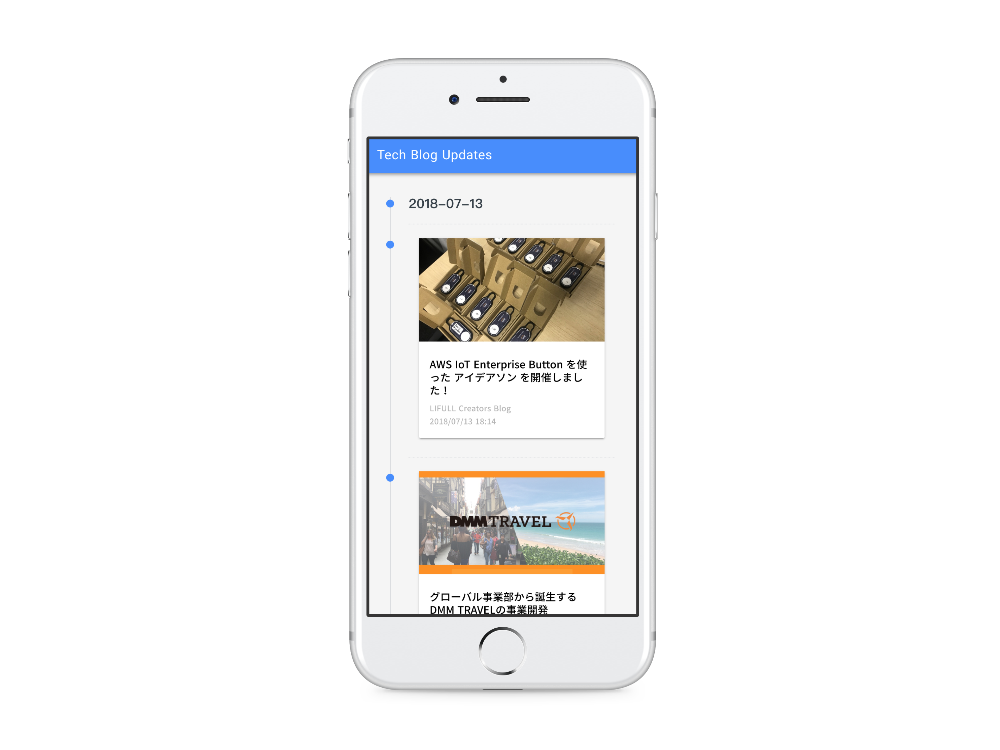

# Japanese Tech Company Blog Updates
Deliver the latest tech news on Japanese technology companies.

Related Project: [kentaro-m/tech-blog-updates-api: A simple serverless application using AWS SAM that collect and deliver the latest tech news on Japanese technology companies.](https://github.com/kentaro-m/tech-blog-updates-api)



## Installation
```
# install dependencies
$ npm install
```

## Usage

### Development
```
# serve with hot reload at localhost:3000
$ API_URL=https://resource-name.execute-api.ap-northeast-1.amazonaws.com/Prod/articles npm run dev
```
Go to http://localhost:3000.

Please [building API on AWS](https://github.com/kentaro-m/tech-blog-updates-api), before server running. Also, set environment variable `API_URL`, when running `npm run dev`.

## License
MIT
